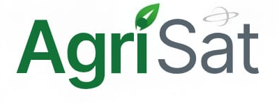
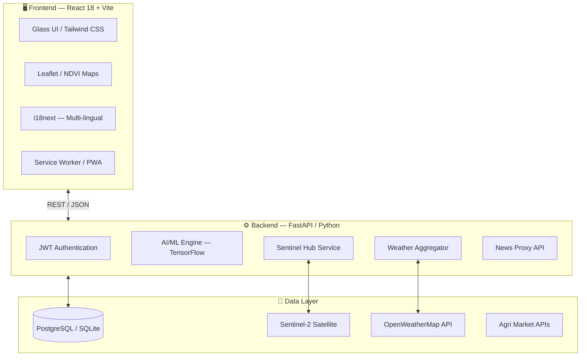

# 🛰️ AgriSat — Precision Agriculture Intelligence Platform

<p align="center">
  
  <br/><br/>
  
  
  
  
  
  <br/>
  <sub>🌿 Official Logo & Favicon: <code>favicon.ico</code></sub>
</p>

> **Empowering farmers with Satellite Precision, AI-Driven Diagnostics, and Real-Time Market Intelligence.**

AgriSat is a production-grade, multi-platform ecosystem that bridges advanced space technology with ground-level farming. By combining Sentinel-2 satellite imagery, TensorFlow-powered crop disease detection, and hyper-local weather intelligence, AgriSat gives every farmer actionable insights to maximize yield and minimize risk.

---

## ✨ Key Features

| Feature | Description |
|---|---|
| 🛰️ **NDVI Satellite Monitor** | Real-time crop health via Sentinel-2 L2A data with interactive field mapping |
| 🧠 **AI Crop Diagnosis** | Deep learning disease detection with treatment plans |
| 📈 **Smart Market Prices** | Live mandi rates + price trend predictions + profit calculator |
| ⛅ **Agri Weather** | 7-day hyper-local forecasts with spray/sow decision windows |
| 📜 **Govt Scheme Finder** | Real-time DBT subsidy & benefit alerts |
| 🌱 **Knowledge Hub** | Cultivation guides, pest management library |
| 📱 **PWA + Native App** | Offline-ready, installable PWA + Android via Capacitor |
| 🌍 **Multi-lingual** | English, Hindi, Odia (i18n) |

---

## 🏗️ Architecture



---

## 🛠️ Tech Stack

**Frontend:**
- **Framework**: React 18 + Vite 5
- **Styling**: Tailwind CSS + Framer Motion + Glassmorphism Design System
- **Maps**: Leaflet + React-Leaflet (NDVI overlay)
- **Charts**: Chart.js + React-Chartjs-2
- **Mobile**: Capacitor 7 (Android/iOS native bridge)
- **PWA**: Workbox + Custom Service Worker

**Backend:**
- **Framework**: FastAPI (Python 3.10+)
- **ORM**: SQLModel (SQLAlchemy + Pydantic)
- **Database**: SQLite (dev) / PostgreSQL+PostGIS (prod)
- **Services**: SentinelHub SDK, Loguru, JWT Auth, Passlib

**DevOps:**
- **Frontend Host**: Vercel (Edge CDN)
- **Backend Host**: Render / DigitalOcean
- **DB**: Supabase (PostgreSQL)

---

## 🚀 Getting Started

### Prerequisites
- **Node.js** v18+
- **Python** v3.10+
- Sentinel Hub API credentials (optional — mock NDVI available)
- OpenWeatherMap API key

### 1. Backend Setup
```bash
cd backend
python -m venv venv
source venv/bin/activate        # Windows: venv\Scripts\activate
pip install -r requirements.txt
cp .env.example .env            # Fill in your credentials
uvicorn main:app --reload --port 8000
```

### 2. Frontend Setup
```bash
cd frontend
npm install
npm run dev                     # Starts on http://localhost:5173
```

### 3. Environment Variables

Create `AgriSat/.env` (root):
```env
DATABASE_URL=sqlite+aiosqlite:///./agrisat.db
SENTINELHUB_CLIENT_ID=your_id
SENTINELHUB_CLIENT_SECRET=your_secret
OPENWEATHER_API_KEY=your_key
JWT_SECRET=supersecretkey
```

Create `frontend/.env`:
```env
VITE_API_URL=http://localhost:8000
VITE_WEATHER_API_KEY=your_key
VITE_MARKET_API_KEY=your_key
VITE_PLANTNET_API_KEY=your_key
VITE_GNEWS_API_KEY=your_key
VITE_YOUTUBE_API_KEY=your_key
```

---

## 📱 Mobile (Android) Deployment

```bash
cd frontend
npm run build
npx cap sync
npx cap open android            # Opens Android Studio
```

---

## 📂 Project Structure

```
AgriSat/
├── backend/
│   ├── routes/          # Auth, Farms, NDVI, Weather, Market, AI
│   ├── models.py        # SQLModel schemas
│   ├── sentinel_service.py
│   ├── weather_service.py
│   └── main.py          # FastAPI entry point
├── frontend/
│   ├── public/
│   │   ├── favicon.ico  # ← Official Brand Icon
│   │   ├── logo.png     # ← Primary Logo
│   │   └── manifest.json
│   └── src/
│       ├── components/  # Reusable UI (Header, BottomNav, Cards...)
│       ├── pages/       # Dashboard, NDVI, Weather, Market...
│       └── index.css    # Global Design System (tokens, glass, neon)
└── capacitor.config.json
```

---

## 🔌 API Reference

| Method | Endpoint | Auth | Description |
|--------|----------|------|-------------|
| POST | `/auth/signup` | — | Register new user |
| POST | `/auth/login` | — | Get JWT token |
| GET | `/farms/` | ✅ | List user farms |
| POST | `/farms/` | ✅ | Create farm boundary |
| POST | `/ndvi/analyze` | ✅ | Run satellite NDVI scan |
| POST | `/ndvi/ml/classify` | ✅ | ML crop classification |
| POST | `/ndvi/yield/predict` | ✅ | Yield prediction |
| GET | `/weather` | — | Hyper-local forecast |
| GET | `/api/news` | — | Agricultural news feed |
| GET | `/market/prices` | — | Commodity market rates |

---

## ☁️ Production Deployment

| Layer | Recommended Service |
|-------|-------------------|
| Frontend | [Vercel](https://vercel.com) |
| Backend | [Render](https://render.com) or [Railway](https://railway.app) |
| Database | [Supabase](https://supabase.com) (PostgreSQL + PostGIS) |
| Files | Cloudinary / Supabase Storage |

---

## 📄 License

MIT License — see [LICENSE](LICENSE) for details.

---

<p align="center">
  Made with ❤️ for the Global Farming Community by <strong>Subhranshu Nanda</strong><br/>
  <sub>AgriSat — Where Satellites Meet the Soil </sub>
</p>
