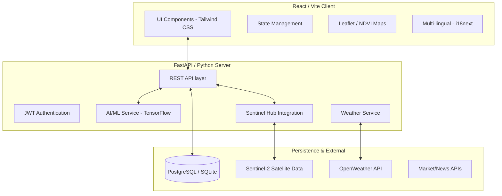

# 🛰️ AgriSat: Next-Gen Agricultural Intelligence Platform


> **Empowering farmers with Satellite Precision, AI-Driven Diagnostics, and Real-Time Market Intelligence.**

AgriSat is a comprehensive, production-grade ecosystem designed to bridge the gap between advanced space technology and ground-level farming. By leveraging Sentinel-2 satellite imagery, TensorFlow-powered crop disease detection, and hyper-local weather forecasting, AgriSat provides actionable insights to maximize yield and minimize risk.

---

## 🌟 Key Features

### 📡 Satellite Monitoring (NDVI)
- **Real-time Crop Health**: Monitor vegetation indices (NDVI) across multiple farm plots using Sentinel-2 L2A data.
- **Historical Analysis**: Track growth patterns and identify anomalies before they become critical.
- **Interactive Mapping**: Polygon-based field management via Leaflet and Sentinel Hub integration.

### 🧠 AI Crop Diagnosis
- **Disease Identification**: Instant diagnosis of crop pests and diseases using deep learning models.
- **Actionable Advice**: Receive tailored treatment plans, organic remedies, and chemical recommendations.
- **Knowledge Hub**: A curated library of cultivation tips and pest management strategies.

### 📊 Market & Weather Intelligence
- **Smart Market Prices**: Real-time commodity prices with trend prediction and profit calculators.
- **Agri-Weather**: 7-day specialized forecasts including precipitation probability, humidity, and optimal spraying windows.
- **Global News**: Aggregated agricultural news and government scheme updates (Direct Benefit Transfer info).

### 📱 Premium UX & PWA
- **Mobile First**: Fully responsive design with Capacitor support for Android/iOS deployment.
- **Offline Ready**: Service Worker caching for critical data in low-connectivity rural areas.
- **Multi-lingual**: Full i18n support (English, Hindi, etc.) for accessibility.

---

## 🏗️ Technical Architecture



---

## 🛠️ Tech Stack

**Frontend:**
- **Framework**: React 18 (Vite)
- **Styling**: Tailwind CSS + Framer Motion
- **Maps**: Leaflet + React-Leaflet
- **Charts**: Chart.js + React-Chartjs-2
- **Mobile**: Capacitor (Native Android/iOS Bridge)

**Backend:**
- **Framework**: FastAPI (Python)
- **ORM**: SQLModel (SQLAlchemy + Pydantic)
- **Database**: SQLite (Local) / PostgreSQL (Production)
- **Services**: SentinelHub Python SDK, TensorFlow, Loguru

**DevOps & Tools:**
- **Hosting**: Vercel (Frontend), Render/DigitalOcean (Backend)
- **PWA**: Workbox
- **Analytics**: Farm Intelligence Engines

---

## 🚀 Getting Started

### 1. Prerequisites
- Node.js (v18+)
- Python (v3.10+)
- Sentinel Hub API Credentials
- OpenWeatherMap API Key

### 2. Backend Setup
```bash
cd backend
python -m venv venv
source venv/bin/activate  # atau venv\Scripts\activate di Windows
pip install -r requirements.txt
cp .env.example .env
# Edit .env with your credentials
python main.py
```

### 3. Frontend Setup
```bash
cd frontend
npm install
npm run dev
```

### 4. Environment Variables
Create a `.env` file in the `frontend` folder:
```env
VITE_API_URL=http://localhost:8000
VITE_WEATHER_API_KEY=your_key
VITE_MARKET_API_KEY=your_key
VITE_PLANTNET_API_KEY=your_key
VITE_GNEWS_API_KEY=your_key
```

---

## 📱 Mobile Deployment
To build for Android:
```bash
cd frontend
npm run build
npx cap add android
npx cap sync
npx cap open android
```

---

## 📂 Project Structure

```text
AgriSat/
├── backend/            # FastAPI Python project
│   ├── routes/         # API endpoints (Auth, Farms, NDVI, Weather, AI)
│   ├── services/       # Business logic (Sentinel, ML, Weather engines)
│   ├── models.py       # SQLModel database schemas
│   └── main.py         # Entry point
├── frontend/           # React / Vite project
│   ├── src/
│   │   ├── components/ # Reusable UI pieces
│   │   ├── pages/      # View components (Dashboard, NDVI Monitor, etc.)
│   │   └── locales/    # i18n translation files
│   └── public/         # Static assets & PWA manifest
└── Capacitor/          # Cross-platform mobile config (Android/iOS)
```

---

## 🔌 API Endpoints (Core)

| Method | Endpoint | Description |
|--------|----------|-------------|
| POST | `/api/auth/signup` | Register a new user |
| POST | `/api/auth/login` | Authenticate and get JWT token |
| GET | `/api/farms` | List user farm plots |
| POST | `/api/farms` | Create a new farm boundary |
| POST | `/api/ndvi/analyze` | Trigger satellite analysis for a farm |
| GET | `/api/weather` | Fetch hyper-local ag-weather |
| GET | `/api/news` | Get global agricultural intelligence |

---

## ☁️ Deployment

### Infrastructure Recommendations
- **Database**: [Supabase](https://supabase.com) (PostgreSQL + PostGIS) for robust spatial data handling.
- **Backend Host**: [Render](https://render.com) or [Railway](https://railway.app) for FastAPI.
- **Frontend Host**: [Vercel](https://vercel.com) for optimized React delivery.

---

## 📄 License
This project is licensed under the MIT License - see the [LICENSE](LICENSE) file for details.

---

<p align="center">
  Developed with ❤️ for the Global Farming Community.
</p>
